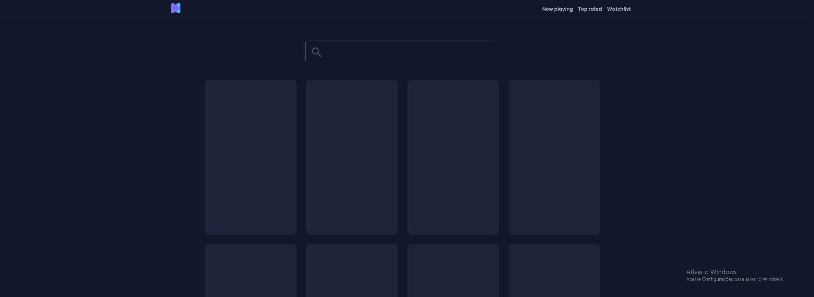
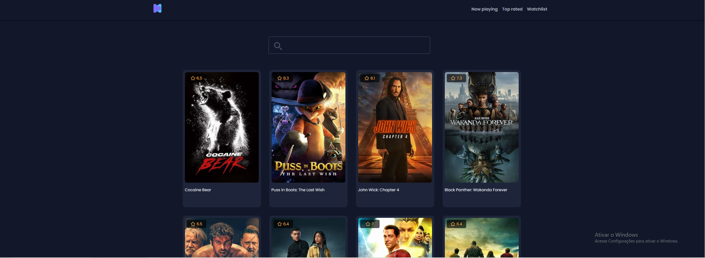
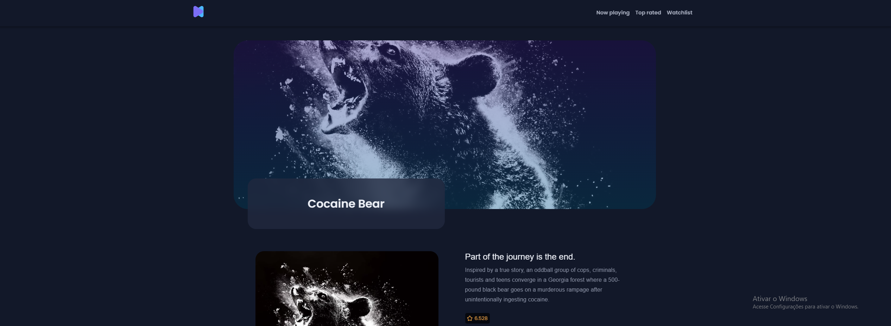
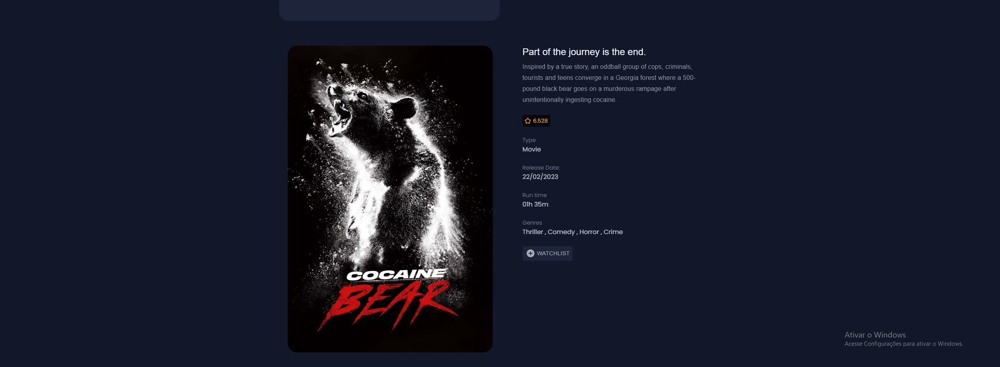
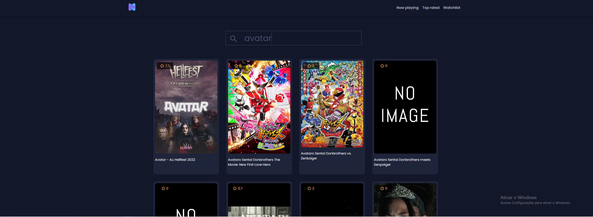
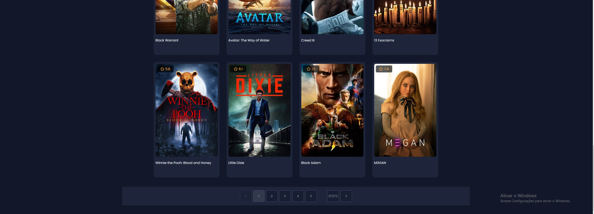
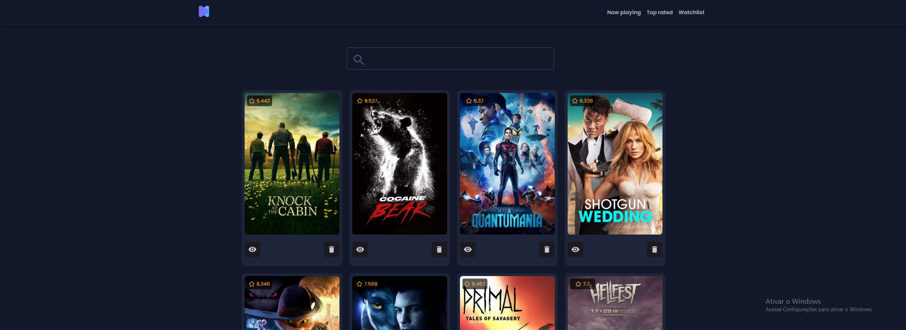

## :wrench: Tecnologias

- [React](https://pt-br.reactjs.org/)
- [React Query](https://react-query-v3.tanstack.com/)
- [Typescript](https://www.typescriptlang.org/)
- [Material-UI](https://mui.com/material-ui/getting-started/overview/)

## 💻 Como usar

- Clone o projeto: `https://github.com/Gabriel200395/react-movie-app.git`
- Entrar na pasta do projeto: `cd react-movie-app`
- baixe na aplicação: `yarn`
- Iniciar a aplicação: `yarn start`
- Testar a aplicação: `yarn test`

Irá abrir uma página no browser (se não abrir, vá até [http://localhost:3000](http://localhost:3000/)).

## :heart_eyes: Features

<h4 align="left">
   
</h4>

<h4 align="left">
   
</h4>

<h4 align="left">
   
</h4>

<h4 align="left">
   
</h4>

<h4 align="left">
   
</h4>

<h4 align="left">
   
</h4>

<h4 align="left">
   
</h4>

## :pencil: Autor

<table>
  <tr>
    <td align="center"><a href="https://github.com/Gabriel200395"> <b>Gabriel Souza</b></a> </td>
  <tr>
</table>
